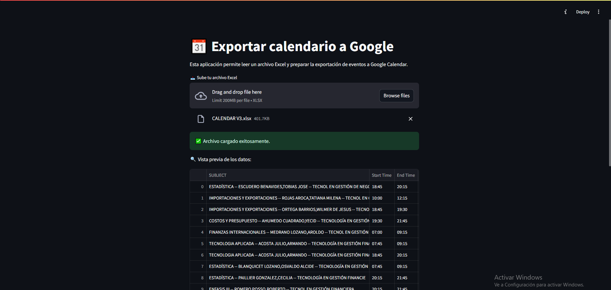

# Admin-Calendar



Esta aplicación permite leer un archivo Excel con eventos y exportarlos a Google Calendar de manera sencilla usando Streamlit.

[SHOWCASE](https://drive.google.com/file/d/17fLPCBUjcZmhq45DaTjvMPBY1CfqmvxH/view?usp=sharing)

## Requisitos

- Python 3.0 o superior
- Las dependencias listadas en `requirements.txt`
- Archivo de credenciales de Google (`credentials.json`)
- Archivo de calendarios en Excel (`datos/Calendarios.xlsx`)

## Instalación

1. **Clona el repositorio o descarga los archivos.**

2. **Instala las dependencias:**
   ```bash
   pip install -r requirements.txt
   ```

3. **Coloca tu archivo `credentials.json`** en la raíz del proyecto.  
   Puedes obtenerlo desde [Google Cloud Console](https://console.cloud.google.com/) creando un proyecto y habilitando la API de Google Calendar.

4. **Asegúrate de tener el archivo `datos/Calendarios.xlsx`** con los nombres e IDs de tus calendarios de Google (Columnas `Nombre` y `Id`).

## Uso

1. **Ejecuta la aplicación:**
   ```bash
   streamlit run app.py
   ```

2. **Carga tu archivo Excel** con los eventos.

3. **Selecciona el calendario** al que deseas exportar los eventos.

4. **Elige las fechas de inicio y fin del semestre.**

5. **Haz clic en "📅 Agendar eventos"** para exportar los eventos a Google Calendar.

6. **Si deseas eliminar eventos**, selecciona el calendario y el rango de fechas, luego haz clic en "❌ Eliminar eventos".

## Notas

- El archivo Excel debe tener las columnas: `Start Time`, `End Time`, `Days`, `SUBJECT`, `Location`.
- Los eventos se crearán en el calendario seleccionado dentro del rango de fechas indicado.
- Los eventos pueden eliminarse por rango de fechas usando la opción correspondiente.

## Soporte

Si tienes dudas o problemas, abre un issue en el repositorio o contacta al desarrollador.

---
¡Gracias por usar Admin-Calendar!
